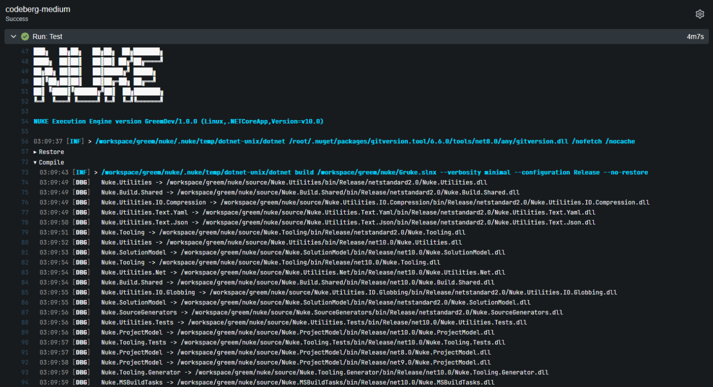

??? warning "Users of Codeberg, please read!"
    Codeberg, a public Forgejo instance hosted by [Codeberg e.V., a German non-profit](https://docs.codeberg.org/getting-started/what-is-codeberg/#what-is-codeberg-e.v.%3F), (currently) has 3 Forgejo runners available for public, open-source use; as well as a lazy variant of each that picks up jobs less frequently.

    Should you choose to use these runners, which you probably will because it's easier than setting up a runner yourself, GRUKE will automatically apply Codeberg's stated timeout to any and all jobs that use them.
    When using a Codeberg hosted runner, the [`TimeoutMinutes`](https://nuke.greemdev.net/docfx/api/Nuke.Common.CI.ForgejoActions.ForgejoActionsAttribute.html#Nuke_Common_CI_ForgejoActions_ForgejoActionsAttribute_TimeoutMinutes)
    property on the `ForgejoActions` attribute is ignored entirely.

    You can find the timeouts and the specs of the different runners [on our DocFX deployment](https://nuke.greemdev.net/docfx/api/Nuke.Common.CI.ForgejoActions.CodebergRunners.html).

    The max timeout is 10 minutes, at the moment. If you need something longer than that, you will need to [install your own Forgejo runner](https://forgejo.org/docs/latest/admin/actions/runner-installation/), or [apply for use of Codeberg's Woodpecker CI](https://docs.codeberg.org/ci/#using-codeberg's-instance-of-woodpecker-ci).
    Woodpecker configuration generation is planned.

    More information: [codeberg.org/actions/meta](https://codeberg.org/actions/meta)

Running on [Forgejo Actions](https://forgejo.org/docs/latest/user/actions/overview/) will automatically enable custom theming for your build log output including collapsible groups for better structuring:



!!! info
    Please refer to the official [Forgejo Actions documentation](https://forgejo.org/docs/latest/user/actions/overview/) for questions not covered here.

## Environment Variables

You can access [predefined environment variables](https://forgejo.org/docs/latest/user/actions/reference/#env-1) by using the `ForgejoActions` class:

```csharp
ForgejoActions ForgejoActions => ForgejoActions.Instance;

Target Print => _ => _
    .Executes(() =>
    {
        Log.Information("Branch = {Branch}", ForgejoActions.Ref);
        Log.Information("Commit = {Commit}", ForgejoActions.Sha);
    });
```

A full reference of available variables and their documentation can be found [here](https://nuke.greemdev.net/docfx/api/Nuke.Common.CI.ForgejoActions.ForgejoActions.html).

## Configuration Generation

You can generate [workflow files](https://forgejo.org/docs/latest/user/actions/reference/#workflow-syntax) from your existing target definitions by adding the `ForgejoActions` attribute. For instance, you can run the `Compile` target on every push with the Small Codeberg runner:

```csharp title="Build.cs"
[ForgejoActions(
    "continuous",
    CodebergRunners.Small,
    On = new[] { ForgejoActionsTrigger.Push },
    InvokedTargets = new[] { nameof(Compile) })]
class Build : NukeBuild { /* ... */ }
``` 

??? note "Generated output"

    ```yaml title=".forgejo/workflows/continuous.yml"
    name: continuous

    on: [push]

    jobs:
      codeberg-small:
        name: codeberg-small
        runs-on: codeberg-small
        timeout-minutes: 5
        steps:
          - uses: https://data.forgejo.org/actions/checkout@v6
          - name: Run './build.cmd Compile'
            run: ./build.cmd Compile
    ```

!!! info
    Whenever you make changes to the attribute, you have to [run the build](../getting-started/execution.md) at least once to regenerate the workflow file.

### Artifacts

If your targets produce artifacts, like packages or coverage reports, you can publish those directly from the target definition:

```csharp
Target Pack => _ => _
    .Produces(PackagesDirectory / "*.nupkg")
    .Executes(() => { /* Implementation */ });
```

??? note "Generated output"

    ```yaml title=".forgejo/workflows/continuous.yml"
    - uses: https://data.forgejo.org/forgejo/upload-artifact@v5
      with:
        name: packages
        path: output/packages
    ```

After your build has finished, those artifacts will be listed under the _Artifacts_ tab, to the left of the build log:


<p style={{maxWidth:'900px'}} markdown="span">


</p>

### Importing Secrets

If you want to use [encrypted secrets](https://forgejo.org/docs/latest/user/actions/basic-concepts/#secrets) from your organization or repository, you can use the `ImportSecrets` property to automatically load them into a [secret parameter](../fundamentals/parameters.md#secret-parameters) defined in your build:

```csharp title="Build.cs"
[ForgejoActions(
    // ...
    ImportSecrets = new[] { nameof(NuGetApiKey) })]
class Build : NukeBuild
{
    [Parameter] [Secret] readonly string NuGetApiKey;
}
```

??? note "Generated output"

    ```yaml title=".forgejo/workflows/continuous.yml"
    - name: Run './build.cmd Publish'
      run: ./build.cmd Publish
      env:
        NuGetApiKey: ${{ secrets.NUGET_API_KEY }}
    ```

!!! note
    If you're facing any issues, make sure that the name in the Forgejo settings is the same as generated into the workflow file.

### Using the Forgejo Token

For every workflow run, Forgejo generates a [one-time token](https://forgejo.org/docs/latest/user/actions/basic-concepts/#automatic-token) with adequate permissions that you can use to authenticate with the Forgejo API.

Unlike on GitHub, you do not need to enable importing this secret; it is always present in your environment variables when running.
Simply accessing the [`Token`](https://nuke.greemdev.net/docfx/api/Nuke.Common.CI.ForgejoActions.ForgejoActions.html#Nuke_Common_CI_ForgejoActions_ForgejoActions_Token) 
property on the [`ForgejoActions`](https://nuke.greemdev.net/docfx/api/Nuke.Common.CI.ForgejoActions.ForgejoActions.html) instance is all you need.

### Caching

By default, the generated workflow file will include a [caching step](https://code.forgejo.org/actions/cache) to reduce the time for installing the .NET SDK (if not preinstalled) and restoring NuGet packages.

??? note "Generated output"

    ```yaml title=".forgejo/workflows/continuous.yml"
    - name: Cache .nuke/temp, ~/.nuget/packages
      uses: https://data.forgejo.org/actions/cache@v5
      with:
        path: |
          .nuke/temp
          ~/.nuget/packages
        key: ${{ runner.os }}-${{ hashFiles('global.json', 'source/**/*.csproj') }}
    ```

You can customize the caching step by overwriting the following properties:

```csharp title="Build.cs"
[ForgejoActions(
    // ...
    CacheKeyFiles = new[] { "**/global.json", "**/*.csproj" },
    CacheIncludePatterns = new[] { ".nuke/temp", "~/.nuget/packages" },
    CacheExcludePatterns = new string[0])]
class Build : NukeBuild { /* ... */ }
```
